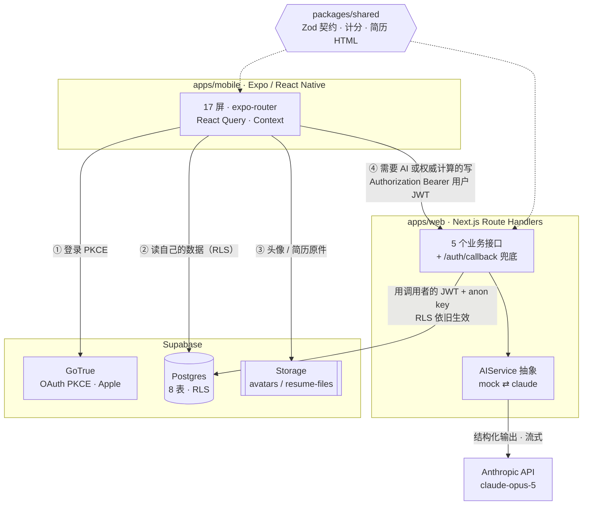
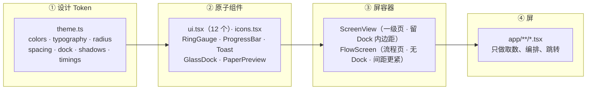
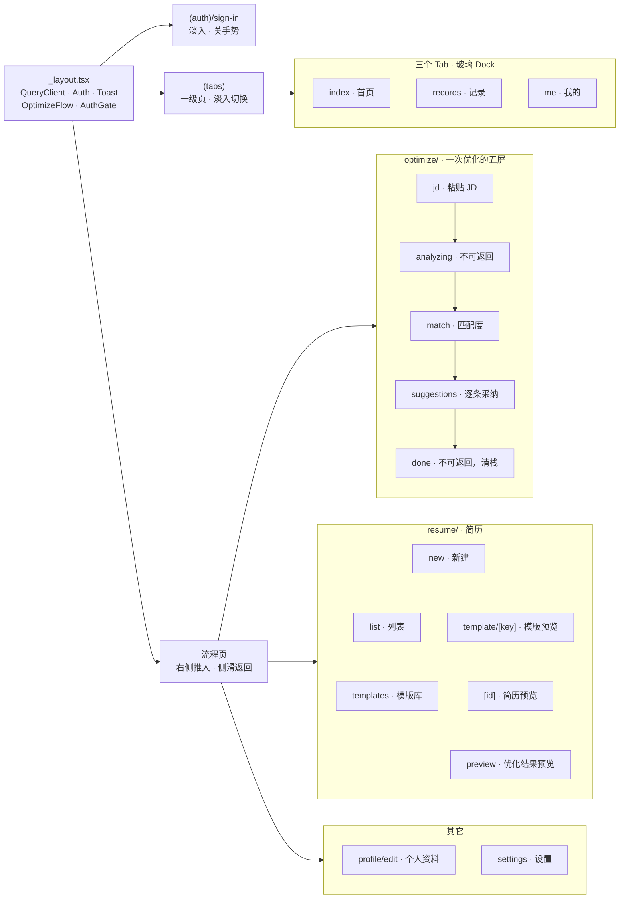
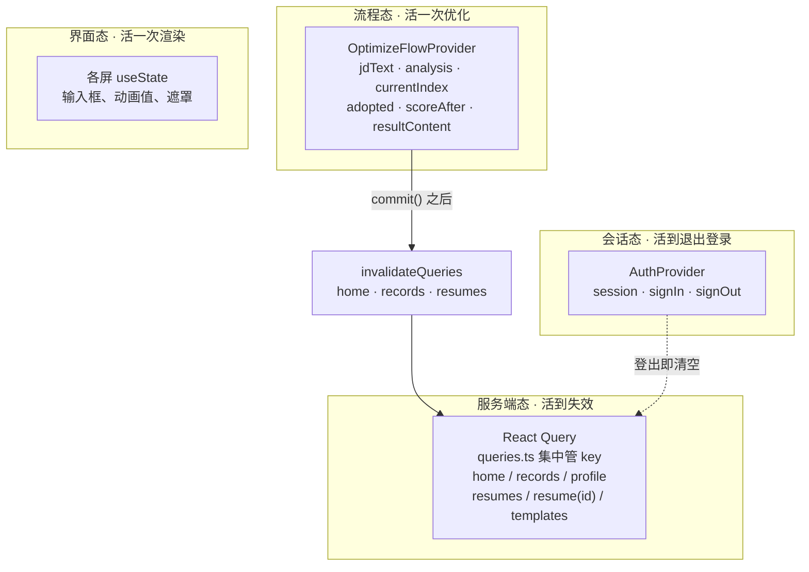
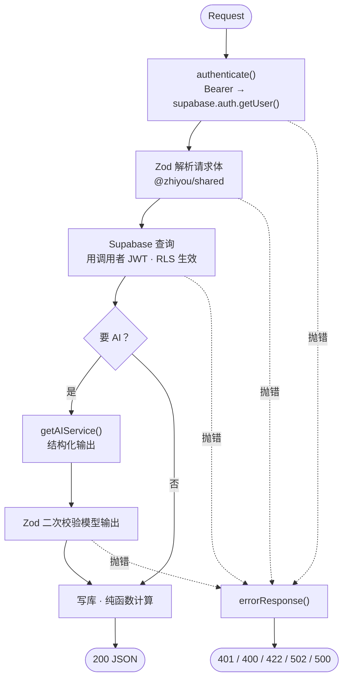
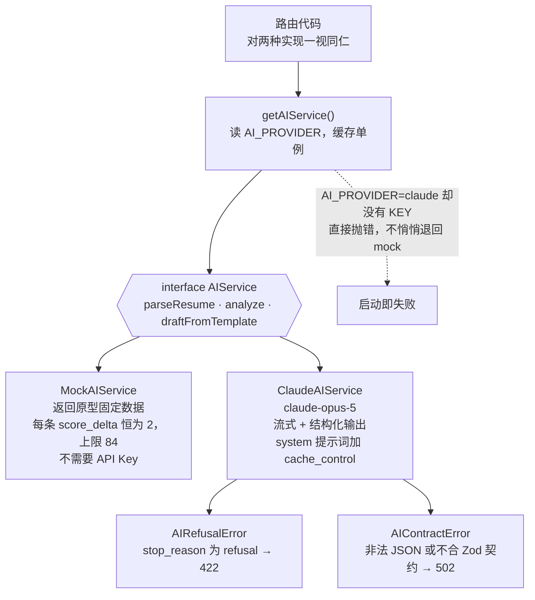
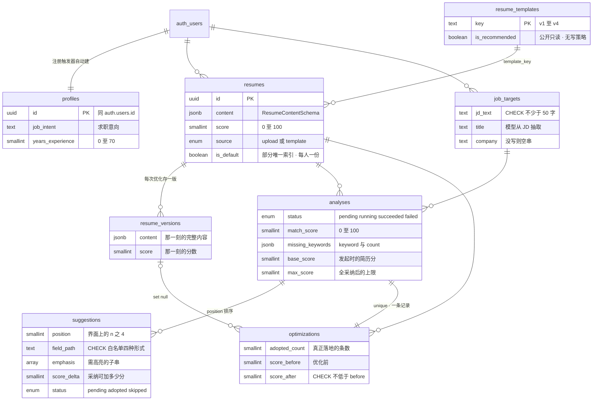
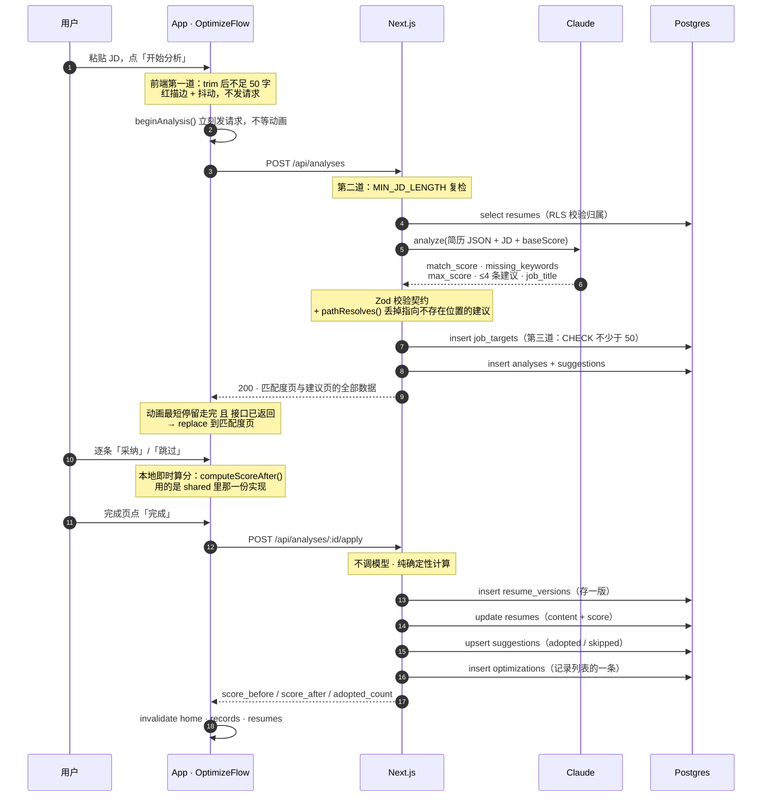
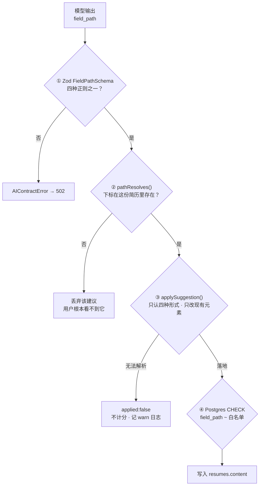
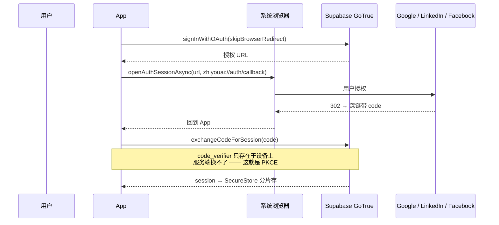

# 职优 AI · 前后端设计说明

一个把简历改得更贴合目标职位的中文求职工具。手机端是 Expo，服务端是 Next.js，
数据与身份托在 Supabase，智能来自 Claude。

这份文档讲的不是「有哪些文件」，而是**每一刀为什么这么切**——职责边界画在哪里、
哪些东西必须两端共用一份实现、模型的输出在落到用户数据之前要过几道闸。

| | |
|---|---|
| workspace 包 | 3（`apps/mobile` · `apps/web` · `packages/shared`） |
| 界面 | 17 屏 |
| 接口 | 5 个业务接口 + 1 个 OAuth 兜底 |
| 数据表 | 8 张 |
| RLS 策略 | 10 条表策略 + 2 条 Storage 策略 |
| AI 能力 | 3 种（parse / analyze / draft） |

---

## §1 整体形态

一个 pnpm workspace，三个包：`apps/mobile` 是用户看到的全部，`apps/web` 是一层薄薄的
服务端，`packages/shared` 是两边共用的契约与纯逻辑。外部依赖只有两家：Supabase 管身份、
数据与文件，Anthropic 管智能。

> **为什么读走数据库、写走接口**
>
> 读简历、读记录、读资料，都是「取自己的行」——RLS 已经把归属判断放进了数据库，
> 再套一层 API 只是把 `select *` 抄一遍，还多一跳延迟。所以读直连 Supabase。
>
> 写不一样。三类写操作必须在服务端：**要调模型的**（API Key 不能进客户端包）、
> **要跨表原子推进的**（一次采纳同时动 4 张表）、**分数这种权威计算**（客户端算的数不能当准）。
> 剩下的写——改个资料、换个模版——照样直连。边界不是按「读/写」画的，
> 是按「谁有资格说了算」画的。

### 三个包的分工

| 包 | 内容 | 关键约束 |
|---|---|---|
| `apps/mobile` | Expo SDK 57 / RN 0.86 / 新架构。iOS、Android、Web 三端同一份代码。全部界面、动效、导航、本地状态。 | 不含任何密钥，只持有设计上就该公开的 anon key |
| `apps/web` | Next.js 16 Route Handlers。没有页面，只有接口——唯一的例外是 OAuth 回调那张兜底 HTML。 | 是 Anthropic API Key 的唯一持有者 |
| `packages/shared` | Zod 契约、计分规则、简历 HTML 渲染器、中文文案、mock 数据。 | 以 TypeScript 源码形式被引用（`exports` 直指 `.ts`），Metro 与 Next 各自编译；零运行时依赖，只有 zod |

---

## §2 前端设计

四层：设计 Token → 原子组件 → 屏容器 → 屏。加上一条正交的状态归属规则。
界面代码里不出现任何颜色、字号、圆角的字面量。

### 路由树：17 屏

`analyzing` 与 `done` 关掉了侧滑手势：分析中途返回会留下半截状态，
完成页只能走右上角「完成」清栈。

### 状态归属：四层，各管各的

「优化完成后首页分数没刷新」这类 bug，根子都在状态放错了地方。这里把状态按**生命周期**
切成四层，每一层有唯一的归属规则，不允许跨层复制。

key 集中在 `queries.ts` 一处，所以「哪些缓存该失效」是一个可以读完的清单，
而不是散在各屏的记忆力测试。

> **为什么优化流程要单独一层 Context**
>
> 粘贴 JD → 分析 → 匹配度 → 逐条采纳 → 完成，五屏读写同一份分析结果。用路由参数传，
> 就要在每次 `push` / `replace` 之间反复序列化一个含四条建议的对象；塞进 React Query，
> 它又不是服务端数据——它是「一次还没提交的编辑」。
>
> 所以给它一层自己的 Context，生命周期就是一次优化：`beginAnalysis()` 开始、
> `commit()` 落库、`reset()` 结束。用户没点「完成」之前数据库里什么都没变，
> `/resume/preview` 因此不能复用 `/resume/[id]`——后者读的是库里那份旧内容。

### 两个界面细节里的设计判断

**动画节奏 vs 真实延迟。** 原型的分析页是 0.7s / 1.5s / 2.2s 依次打勾、2.8s 跳转，
真实模型调用比这慢。做法：前两步（读简历、对比 JD，本就在本地）按原时间轴打勾；
第三步等接口真的返回才打勾，在那之前保持转圈；跳转要求「最短停留走完」**且**
「接口已返回」两个条件同时满足。快的时候节奏与原型一致，慢的时候不假装它算完了。

**一份 HTML，两个出口。** App 内预览走 `react-native-webview`，导出 PDF 走 `expo-print`
——两者渲染的是 `renderResumeDocument()` 同一份 HTML，只切 `preview` / `print` 模式。
尺寸统一走 `calc(x * var(--s))`：预览 `--s:1` 与截图逐像素一致，打印 `--s:1.75` 并加 A4 边距。
四种版式因此不可能「预览好看、导出走样」。

---

## §3 后端设计

五个业务接口，没有一个是 CRUD 转发。每一个的存在理由都是「这件事客户端做不了或不该做」。

| 接口 | 调模型 | 写入 | 存在理由 |
|---|---|---|---|
| `POST /api/analyses` | effort: high | `job_targets` `analyses` `suggestions` | 主流程核心。一次调用产出匹配度页与建议页的**全部**数据，随后连同 JD 一起落库。 |
| `GET /api/analyses/[id]` | 否 | — | 回看一次分析。归属完全交给 RLS。 |
| `POST /api/analyses/[id]/apply` | 否 | `resume_versions` `resumes` `suggestions` `optimizations` | 纯确定性计算。改写文案在建议里已经有了，这一步只是按 `field_path` 写回、算新分、存版本、插记录。 |
| `POST /api/resumes/parse` | effort: medium | — | PDF / 图片直接作为内容块交给模型；Word 先用 mammoth 转纯文本。20MB 上限、白名单 MIME。 |
| `POST /api/resumes/from-template` | effort: medium | `resumes` | **只服务新用户**。已有简历换模版不走这里——内容已是结构化数据，换模版只是换版式，客户端改 `template_key` 即可（走这里返回 409）。 |
| `GET /auth/callback` | 否 | — | 兜底。正常路径深链直接回 App；桌面浏览器或只允许 https 回调的 provider 会落到这里，把 code 转交给深链。 |

### 每个接口的同一条流水线

唯一的错误出口是 `errorResponse()`：对客户端只吐分类与一句人话，
模型原始返回和数据库报错留在服务端日志——那些内容可能带着用户简历的片段。

> **为什么服务端不用 service_role**
>
> 这些接口操作的全是用户自己的数据。用 `anon key` + 转发调用者的 JWT 就够了，
> 而且这样 **RLS 策略在服务端路径上依然生效**——即便某条路由的归属判断写错了，
> 数据库也会兜住。`service_role` 会绕过 RLS，把安全边界从数据库挪到应用代码里。
> 对这些接口，没有理由付这个代价。

---

## §4 AI 接入层

模型能力被收在一个三方法的接口后面，两个实现，一个环境变量切换。路由代码对两者一视同仁。

### 调用侧的六个具体取舍

- **必须流式。** Opus 5 默认开启 adaptive thinking，thinking 与正文共用 `max_tokens`；
  在 16k–32k 这个量级下，非流式请求有 HTTP 超时风险。
- **effort 分级。** `analyze` 用 `high`——它是全 App 唯一真正吃智能的环节；
  `parseResume` 和 `draftFromTemplate` 是抽取类任务，`medium` 足够且更省 token 与延迟。
- **提示词缓存。** system 提示词每次调用完全一致，加 `cache_control` 后重复请求按缓存读计费。
- **拒答不是网络错误。** 它走 HTTP 200 + `stop_reason: 'refusal'`，直接索引 `content[0]` 会崩。
  先判 `stop_reason` 再读内容，映射成 422 而不是 500。
- **服务端兜底 + 降级重试。** 默认带 fallback beta 让分类器拒答时由兜底模型在同一次调用里接手；
  beta 未放开的账号会被拒，此时退回不带兜底的调用——拒答守卫依然生效。
- **JSON Schema 手写，不从 Zod 导出。** 它是与模型之间的契约，需要满足
  「每个对象 `additionalProperties:false`、所有字段进 `required`」；显式写出来比依赖导出器的
  具体行为可靠。返回后仍用 shared 的 Zod schema 再校验一遍。

> **提示词是产品的一部分，不是配置**
>
> 三条针对 Opus 5 的措辞取舍写进了 `prompts.ts`：显式要求简洁，因为默认输出偏长而
> 「建议改为」的卡片版面是固定的；**不写「请自检 / 请复核」**，因为 Opus 5 本来就会自我验证，
> 这类指令只会引发过度验证；明确限定输出范围，避免它自行扩展任务。
>
> 判断口径也写死在提示词里：`match_score` 看硬性要求与经历相关度，**不因为文案写得好看就加分**；
> `original_text` 必须逐字取自简历，不能改写或概括——否则采纳时会找不到落点。

---

## §5 数据模型

8 张表，一一对应界面上的一个概念。简历内容存 `jsonb`，因为它的形状由 Zod 定义、随产品演进；
其余全是关系字段，交给数据库做约束。

约束不是装饰：`resumes_one_default_per_user` 是部分唯一索引，
`score_after >= score_before` 是 CHECK，JD 长度门槛在数据库上再兜一道。

> **为什么 suggestions 没有 user_id**
>
> 它的归属只可能来自 `analyses`。冗余一个 `user_id` 意味着两处真相，总有一天会不一致——
> 所以 RLS 策略用 `exists (select 1 from analyses …)` 判断，多一次索引查找，
> 换掉一整类「数据对不上」的 bug。
>
> 同理，`emphasis` 是 `text[]` 而不是把 `<b>` 标签混进 `suggested_text`——RN 没有 `innerHTML`，
> 而且把展示标记混进数据，采纳时就会把标签一起写进用户的简历。

---

## §6 主流程时序

从粘贴 JD 到分数落库。注意两处：分析**只调一次模型**，采纳**一次都不调**。

第 7 步的 `pathResolves()` 是模型幻觉的最后一道过滤：模型可能引用一条它自己想象出来的经历，
那样采纳时会静默不生效。

> **为什么完成页的数字和库里的数字不可能对不上**
>
> `computeScoreAfter()` 只有一份实现，放在 `packages/shared`。前端在用户每点一次「采纳」时
> 用它算出完成页要显示的数；服务端在 `apply` 里用**同一个函数**算落库的数。
>
> 公式本身也被抽象过：原型写死「初始 76 / 每采纳 +2 / 上限 84」，这里表达为
> `min(before + Σdelta, max_score)`。Mock 把每条 delta 设为 2、上限设为 84，于是逐位复现原型；
> 真实模型给出各自的分值，走同一个公式。**前端代码路径完全一致。**

---

## §7 安全边界

有两个不可信来源：用户上传的文件，和模型的输出。两者都会变成用户简历里的文字，
也都会进 WebView 渲染。所以每一条从它们通向数据的路径上都有闸。

### 闸门一：field_path 白名单

模型返回的 `field_path` 决定「改写要写进简历的哪个位置」。这是一个由 LLM 产出、
随后用来**写入用户数据**的字符串——绝不能做动态属性写入。

只有 `summary`、`skills`、`exp[i].lis[j]`、`projects[i].lis[j]` 四种形式通得过，
且**绝不为了让一条建议生效而凭空创建段落**。第三道拦下的建议不计分——
用户看到的分数必须对应真正落地的改动。

### 闸门二：RLS 是唯一的归属判断

| 表 | 策略 | 判断方式 |
|---|---|---|
| `profiles` | select / insert / update 各一条 | `auth.uid() = id`（主键就是 user id，没有 delete） |
| `resumes` `resume_versions` `job_targets` `analyses` `optimizations` | 各一条 `for all` | `auth.uid() = user_id` |
| `suggestions` | `for all` | `exists(select 1 from analyses …)` —— 无 user_id，经 analysis 判断 |
| `resume_templates` | 只有一条 select | `true` —— 公开只读，**没有任何写策略** |
| `storage.objects` | 两条 `for all` | `(storage.foldername(name))[1] = auth.uid()` —— 按 `{user_id}/` 分目录 |

- 策略里一律写 `(select auth.uid())` 而不是裸 `auth.uid()`——这样规划器把它当 InitPlan
  **求值一次**，而不是每行调一次函数。
- anon key 进客户端包是**设计上就要公开的**：真正的访问控制在 RLS 上，不在 key 的保密性上。
- 会话 token 存 `expo-secure-store`（Keychain）而不是 AsyncStorage——它们是凭据。
  且 JWT 常超过 SecureStore 单值 2048 字节上限，直接写会被**静默截断**，
  表现为「登录成功但重启后掉登录」，所以按 1800 字节分片存。

### 闸门三：渲染

- 简历内容来自用户上传与模型输出，`renderResumeDocument()` 里逐字段 `escapeHtml()` 后
  才拼进 HTML——否则 WebView 里就是一个 XSS。原型是固定假数据所以没做这一步。
- 简历纸是纯展示、零交互，`PaperPreview` 直接**关掉 WebView 的 JavaScript**。
- v3「数据成果型」模版原型里把「DAU +25% · 转化 +12%」写死在版式里——那是示例人物的数据。
  真实实现改为从本人的要点里正则抽百分比成果，最多 3 条，一条都没有就整块不渲染。
  柱子高度用固定梯度，**不谎称是真实比例**。

### 登录：为什么必须有 Apple

三家 OAuth 共用一条 PKCE 路径，**Expo Go 里就能跑**，不需要 dev build。
Sign in with Apple 走原生弹层拿 `identityToken` 再 `signInWithIdToken`——需要原生模块，
只能在 dev build 或正式包里验。

> **Apple 登录不是可选项**
>
> App Store 审核指南 4.8：只要提供第三方社交登录，就必须同时提供一个等效的、
> 限制数据收集、允许隐藏邮箱、不做追踪的选项。Google / LinkedIn / Facebook 都不满足。
> **不加会被拒审。**

---

## §8 共用契约层

`packages/shared` 是这套架构里最关键的一块。它决定了哪些东西在前后端之间**不可能不一致**。

| 模块 | 内容 | 被谁用 | 它消灭了哪一类 bug |
|---|---|---|---|
| `schemas.ts` | ResumeContent · Suggestion · AnalyzeResponse · 请求响应契约 · `MIN_JD_LENGTH` | App / API / 模型输出校验 | 「接口改了字段，客户端不知道」 |
| `scoring.ts` | `computeScoreAfter` · `applySuggestions` · `splitEmphasis` · `formatResumeMeta` · `scoreHint` | 完成页实时算分 / apply 落库算分 | 「界面显示 84，库里是 82」 |
| `resume-html.ts` | 四套版式的唯一渲染实现，`preview` / `print` 双模式 | WebView 预览 / expo-print 导出 | 「预览好看、导出走样」 |
| `i18n/zh-CN.ts` | 全部界面文案，含带参函数（`copy.done.gain(n)`） | App | 「同一句话在两屏写法不同」 |
| `mock/index.ts` | 模版元数据、三份示例简历、示例 JD、四条示例建议 | App 演示态 / MockAIService / 测试 | 「演示数据和真实结构对不上」 |

### 没有密钥也能跑通全链路

这不是「顺便支持一下离线」，是刻意设计的：**三个独立的降级开关**，任何一个没配都不会把人卡住。

- **`AI_PROVIDER=mock`** —— 默认值。没有 Anthropic Key 也能把服务端全链路跑通，CI 同理。
- **未配 Supabase** —— `AuthGate` 直接放行，刚 clone 下来的人不用先建 Supabase 项目
  就能 `pnpm mobile` 扫码把 17 屏走一遍。
- **无 Docker 的 DB 测试** —— `scripts/db-test-local.sh` 起一个临时 Postgres，
  用 `_harness.sql` 复刻 `auth.uid()`、角色与 storage 结构，
  把**真实的迁移与 RLS 断言**跑在真实的 Postgres 上。

> **测试放在真正会错的地方**
>
> 单测只有两个文件，都在 `packages/shared`：`scoring.test.ts` 和 `resume-html.test.ts`——
> 计分公式与 HTML 转义是**纯函数且后果严重**，值得逐条断言。
>
> RLS 则用 SQL 断言直接压在数据库上：造第二个用户 B，验证 A 看得到自己的 2 份简历、
> 且**完全看不到 B 的那一份**，任何一条不成立就 `raise exception` 让命令非零退出。
> 安全关键的东西不能只靠肉眼看策略文本。

---

## §9 现状与接线点

服务端、数据库、契约层已经是最终形态。客户端界面全部完成，但取数还接在本地 mock 上——
这是有意为之的一个单点。

| 部分 | 状态 | 说明 |
|---|---|---|
| `packages/shared` | 完成 | 契约、计分、渲染器、文案、mock；两个测试文件覆盖纯函数 |
| `supabase/` | 完成 | 8 表 + 10 条表策略 + 2 条 Storage 策略 + 2 个 bucket + 注册触发器 + 种子数据 + SQL 断言 |
| `apps/web` | 完成 | 5 接口 + OAuth 兜底 + AIService 双实现。尚无接口层测试 |
| `apps/mobile` 界面 | 完成 | 17 屏、玻璃 Dock、四套简历版式、PDF 导出、四家登录 |
| `apps/mobile` 取数 | 待接线 | `lib/api.ts` 目前由 shared 的 mock 常量 + 一份内存态支撑 |

> **为什么接线只需要改一个文件**
>
> `lib/api.ts` 里每个函数的**签名就是最终形态**：`getHomeSnapshot()`、`runAnalysis()`、
> `applyOptimization()`、`importResume()`——函数体从「读内存态」换成
> 「查 Supabase / 打 Next.js 接口」，界面与 hook 一行不动。
>
> 这也是为什么服务端的 `apply` 接口和客户端的 `optimizeFlow.commit()` 做的是同一件事、
> 用的是同一个 `applySuggestions()`：接线时前者取代后者，中间没有需要重新对齐的语义。

### 接下来自然要补的

- `lib/api.ts` 换成真实实现；`analyses` 的 `pending/running` 状态目前没用上——
  长分析改成异步任务时它们就位了。
- 接口层测试：`apps/web` 已配 vitest 但还没有测试文件；`apps/mobile` 已配 jest-expo 同理。
- 简历原件上传到 `resume-files` bucket 并回填 `source_file_path`——
  目前 parse 接口只解析不存档。
- 三家 OAuth 的真实凭据（本地栈默认关闭，见 `supabase/config.toml`）。

---

职优 AI · `zhiyou-ai` · pnpm workspace · Node ≥ 20
`apps/mobile`（Expo 57 / RN 0.86）· `apps/web`（Next.js 16 / React 19）· `packages/shared`（zod）
Supabase Postgres + GoTrue + Storage · Anthropic `claude-opus-5`
